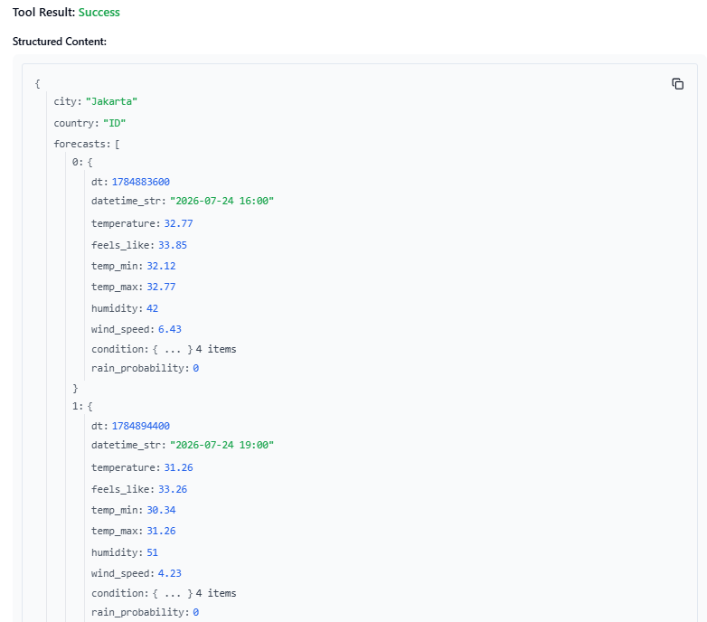
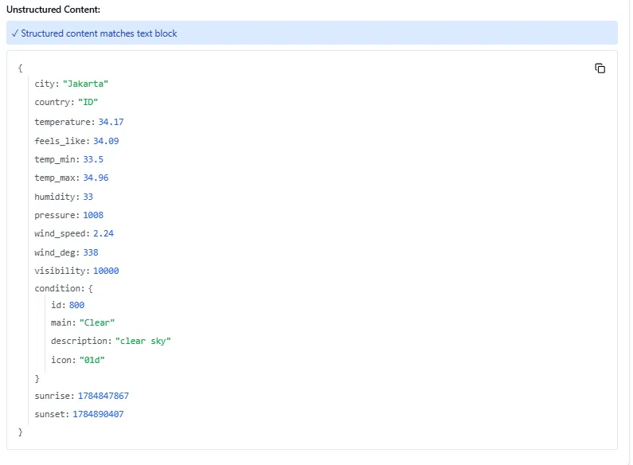
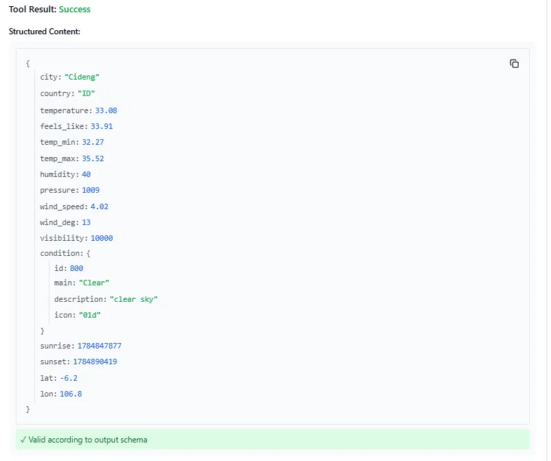

# MCP Weather Server

A Model Context Protocol (MCP) server that provides weather data via the OpenWeather API. Built with FastMCP, fully tested with pytest, and containerized with Docker.

## Demo

### get_current_weather


### get_forecast


### get_weather_by_coords


## Features

- `get_current_weather(city)` — Current weather by city name
- `get_forecast(city, days)` — 3-hour interval forecast up to 5 days
- `get_weather_by_coords(lat, lon)` — Weather by geographic coordinates
- Full pytest coverage with mocked HTTP responses
- Multi-stage Docker build
- GitHub Actions CI

## Quick Start

### 1. Clone & Install

```bash
git clone https://github.com/rangga-jakti/mcp-weather-server
cd mcp-weather-server

cp .env.example .env
# Edit .env → add your OPENWEATHER_API_KEY

make install
```

### 2. Run

```bash
make run
```

### 3. Run with Docker

```bash
make docker-build
make docker-run
```

## Testing

```bash
make test        # Run all tests with coverage
make test-v      # Verbose output
```

Coverage report saved to `htmlcov/index.html`.

## Integrate with Claude Desktop

Add to `claude_desktop_config.json`:

```json
{
  "mcpServers": {
    "weather": {
      "command": "docker",
      "args": ["run", "--rm", "-i", "--env-file", ".env", "mcp-weather-server"]
    }
  }
}
```

Then ask Claude: *"Cuaca Jakarta sekarang gimana?"*

## API Key

Get a free OpenWeather API key at [openweathermap.org](https://openweathermap.org/api).

## Tools Reference

| Tool | Parameters | Description |
|------|-----------|-------------|
| `get_current_weather` | `city: str` | Current weather by city |
| `get_forecast` | `city: str`, `days: int (1-5)` | Multi-day forecast |
| `get_weather_by_coords` | `lat: float`, `lon: float` | Weather by coordinates |
| `get_air_quality` | `city: str` | AQI & pollutant levels (CO, NO2, O3, PM2.5, dll) |

## Project Structure

```
mcp-weather-server/
├── src/weather/
│   ├── __init__.py
│   ├── client.py       # OpenWeather API client
│   ├── config.py       # Pydantic settings
│   ├── exceptions.py   # Custom exceptions
│   ├── models.py       # Pydantic models
│   └── server.py       # FastMCP server & tools
├── tests/
│   ├── conftest.py
│   ├── test_client.py
│   ├── test_tools.py
│   └── test_exceptions.py
├── Dockerfile
├── docker-compose.yml
├── Makefile
└── pyproject.toml
```

## License

MIT
